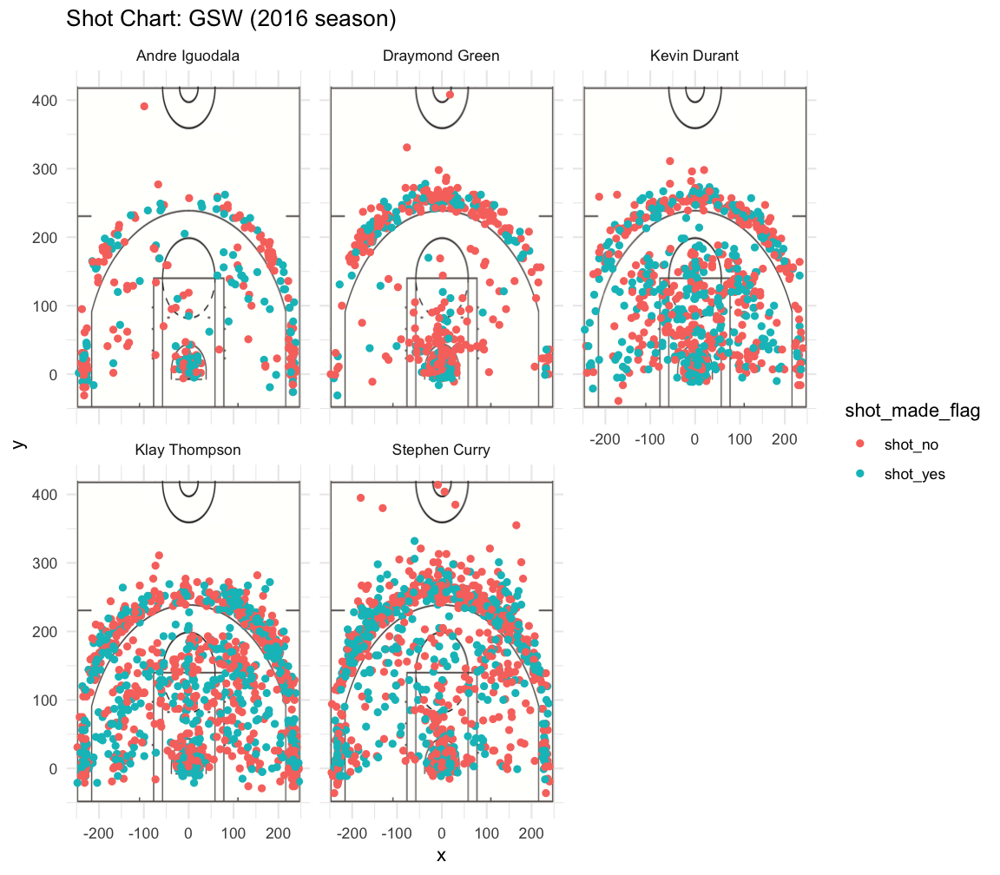

workout01-hamza-rana
================
Hamza Rana

``` r
library(dplyr)
```

    ## 
    ## Attaching package: 'dplyr'

    ## The following objects are masked from 'package:stats':
    ## 
    ##     filter, lag

    ## The following objects are masked from 'package:base':
    ## 
    ##     intersect, setdiff, setequal, union

``` r
twotable <- data.frame("names" = c("Stephen Curry", "Kevin Durant", "Draymond Green", "Klay Thompson", "Andre Iguodala"))
threetable <- data.frame("names" = c("Stephen Curry", "Kevin Durant", "Draymond Green", "Klay Thompson", "Andre Iguodala"))
totaltable <- data.frame("names" = c("Stephen Curry", "Kevin Durant", "Draymond Green", "Klay Thompson", "Andre Iguodala"))

shots_data <- read.csv("../data/shots-data.csv", stringsAsFactors = FALSE)

sc <- filter(shots_data, name == "Stephen Curry")
kd <- filter(shots_data, name == "Kevin Durant")
dg <- filter(shots_data, name == "Draymond Green")
kt <- filter(shots_data, name == "Klay Thompson")
ai <- filter(shots_data, name == "Andre Iguodala")

sc2 <- filter(sc, shot_type == "2PT Field Goal") 
kd2 <- filter(kd, shot_type == "2PT Field Goal")
dg2 <- filter(dg, shot_type == "2PT Field Goal")
kt2 <- filter(kt, shot_type == "2PT Field Goal")
ai2 <- filter(ai, shot_type == "2PT Field Goal")


twotable$total <- c(sum(sc$shot_type == "2PT Field Goal"), sum(kd$shot_type == "2PT Field Goal"), sum(dg$shot_type == "2PT Field Goal"), sum(kt$shot_type == "2PT Field Goal"), sum(ai$shot_type == "2PT Field Goal"))

twotable$made <- c(sum(sc2$shot_made_flag == "shot_yes"), sum(kd2$shot_made_flag == "shot_yes"), sum(dg2$shot_made_flag == "shot_yes"), sum(kt2$shot_made_flag == "shot_yes"), sum(ai2$shot_made_flag == "shot_yes"))

twotable$perc_made <- (twotable$made)/(twotable$total)
arrange(twotable, desc(perc_made))
```

    ##            names total made perc_made
    ## 1 Andre Iguodala   210  134 0.6380952
    ## 2   Kevin Durant   643  390 0.6065319
    ## 3  Stephen Curry   563  304 0.5399645
    ## 4  Klay Thompson   640  329 0.5140625
    ## 5 Draymond Green   346  171 0.4942197

``` r
sc3 <- filter(sc, shot_type == "3PT Field Goal") 
kd3 <- filter(kd, shot_type == "3PT Field Goal")
kt3 <- filter(kt, shot_type == "3PT Field Goal")
ai3 <- filter(ai, shot_type == "3PT Field Goal")
dg3 <- filter(dg, shot_type == "3PT Field Goal")

threetable$total <- c(sum(sc$shot_type == "3PT Field Goal"), sum(kd$shot_type == "3PT Field Goal"), sum(dg$shot_type == "3PT Field Goal"), sum(kt$shot_type == "3PT Field Goal"), sum(ai$shot_type == "3PT Field Goal"))

threetable$made <- c(sum(sc3$shot_made_flag == "shot_yes"), sum(kd3$shot_made_flag == "shot_yes"), sum(dg3$shot_made_flag == "shot_yes"), sum(kt3$shot_made_flag == "shot_yes"), sum(ai3$shot_made_flag == "shot_yes"))

threetable$perc_made <- (threetable$made)/(threetable$total)
arrange(threetable, desc(perc_made))
```

    ##            names total made perc_made
    ## 1  Klay Thompson   580  246 0.4241379
    ## 2  Stephen Curry   687  280 0.4075691
    ## 3   Kevin Durant   272  105 0.3860294
    ## 4 Andre Iguodala   161   58 0.3602484
    ## 5 Draymond Green   232   74 0.3189655

``` r
totaltable$total <- c(nrow(sc), nrow(kd), nrow(dg), nrow(kt), nrow(ai))

totaltable$made <- c(sum(sc$shot_made_flag == "shot_yes"), sum(kd$shot_made_flag == "shot_yes"), sum(dg$shot_made_flag == "shot_yes"), sum(kt$shot_made_flag == "shot_yes"), sum(ai$shot_made_flag == "shot_yes"))

totaltable$perc_made <- (totaltable$made)/(totaltable$total)

arrange(totaltable, desc(perc_made))
```

    ##            names total made perc_made
    ## 1   Kevin Durant   915  495 0.5409836
    ## 2 Andre Iguodala   371  192 0.5175202
    ## 3  Klay Thompson  1220  575 0.4713115
    ## 4  Stephen Curry  1250  584 0.4672000
    ## 5 Draymond Green   578  245 0.4238754

Narrative
=========

### Introduction

Every shot taken in the NBA has a variety of characteristics that can be used to describe it. The player taking the shot, at what time in the game it was taken, what kind of shot it was, where on the court the shot was taken, and how many points are rewarded are just a few examples. With so many different factors involved in each and every shot taken in the league, it is important to be able to analyze the data surrounding these shots, which may well be factors that can ultimately affect how well a team performs. This report compiles and examines the shot data of five NBA players, and then manipulates the data in order to view it graphically and analyze it. Different factors that involve taking shots are analyzed for Andre Iguodala, Kevin Durant, Stephen Curry, and Draymond Green.

### Background and Data

The data files that we start off with include statistics for shots taken by each individual player. There are five files, each of which refers to the players being examined. The data encapsulated in these files include information regarding each shot that was taken. The recorded data include the name of the player's team, the date, season, period, minutes left in the game, seconds left in the game, whether or not the shot was made, what kind of action was attempted to make the shot, how many points the shot was for, distance of the shot, the name of the opposing team, and the x and y coordinates from where the shot was made.

Each shot can vary in technique, with some examples being Jump Shots, Alley Oop Dunk Shots, and Driving Dunk Shots. This also affects how many points the shot was for, with each shot being worth either two or three points. The type of shot also changes with distance from the net, which means the x and y variables also impact the technique used to shoot a shot. With such a high number of variables that change for each shot, we narrow our analysis to the position from which the ball was thrown (x and y cooordinates) and the frequency of successfull shots made.

### Analysis and Discussion

When viewing the proportion of shots made by each individual player, we can obtain three tables that show us frequencies of successful shots, separated into charts showing two-pointers, three-pointers, and total shot frequencies. The following table shows frequencies of two-point shots made by the five players.

    ##            names total made perc_made
    ## 1 Andre Iguodala   210  134 0.6380952
    ## 2   Kevin Durant   643  390 0.6065319
    ## 3  Stephen Curry   563  304 0.5399645
    ## 4  Klay Thompson   640  329 0.5140625
    ## 5 Draymond Green   346  171 0.4942197

This table ranks the percentage of two-point shots made, arranged in descending order. We can see that Andre Iguodala is the leader here with 63.8% of his shots being successful, and Draymond Green is on the bottom with 49.4% of his two-point shots made. Although this table ranks the percentages of each of these players' performance in making successful shots, it is important to keep in mind that there is a lot of variation in the number of shots that was taken from player to player. For example, although Andre Iguodala is at the top, he has only taken 210 shots, which is fewer than any of the other four players. Kevin Durant's frequency of shots made is not as high as Iguodala's, but he has taken more than three times as many shots, meaning his statistics are likely to be more accurate and fluctuate less as time continues. The statistics for these players also varies with point type, as a similar table for three-point shots shows below.

    ##            names total made perc_made
    ## 1  Klay Thompson   580  246 0.4241379
    ## 2  Stephen Curry   687  280 0.4075691
    ## 3   Kevin Durant   272  105 0.3860294
    ## 4 Andre Iguodala   161   58 0.3602484
    ## 5 Draymond Green   232   74 0.3189655

This table is arranged similarly to the one above, with rankings of three-point shots made in descending order. Unlike the table before, Andre Iguodala is now near the bottom and Klay Thompson is now at the top. One consistency between the two tables is Draymond Green's spot. Similarly to the last table, we still see large variations in the number of shots taken. Andre Iguodala has only 161 total shots, whereas Stephen Curry has 687. This large discrepancy between the number of shots taken shows that for those with fewer shots, such as Iguodala, the data may not be reflective of long-term performance. After looking at these individual tables, we can also analyze frequencies of shots made, regardless of their point value in a similar tabular format.

    ##            names total made perc_made
    ## 1   Kevin Durant   915  495 0.5409836
    ## 2 Andre Iguodala   371  192 0.5175202
    ## 3  Klay Thompson  1220  575 0.4713115
    ## 4  Stephen Curry  1250  584 0.4672000
    ## 5 Draymond Green   578  245 0.4238754

From this table we can see that Kevin Durant, who was not on top for two-point or three-point shots, is now leading the board in percentage of successful shots made. This has to do with the fact that his percentage of two-pointers made was at a high 60.6%, and the number of two-pointers that he shot was also very high at 643. All sucessful three-pointer frequencies were below 43%, and since a high fraction of Durant's shots were three-pointers (643 out of 915), the weightage of successful two-point shots carries his overall percentage to the top. Since Draymond Green was at the bottom for both point types, it is not surprising that he also has the lowest proportion of overall shots made. Overall, the biggest impact on shooting accuracy regarding these tables seems to be the variability in the number of shots taken, which can impact accuracy for specific point-types and the overall percentage of shots made.

Another important factor to consider when shots are taken is the position of the player. We can visualize this with a graph showing positions on the court at which each shot was taken, and separate these graphs by player.



These graphs also reflect the previous data regarding which players make which shots. The players making more three-point shots are more successful taking shots farther away from the net, and those with a high frequency of successful two points shots have more completed shots close to the net. The colored points in the graphs show hits and misses,
